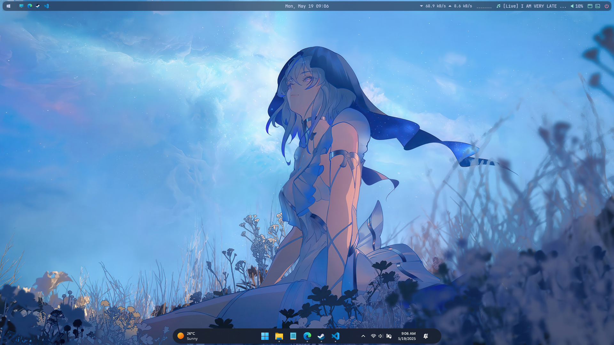
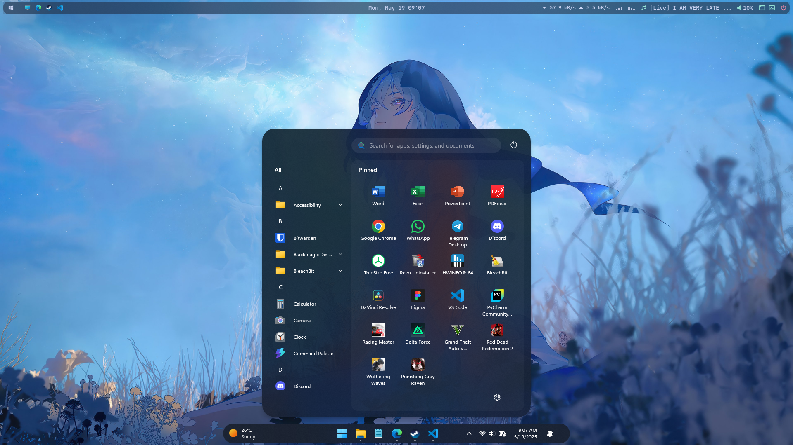

# 
Windows 11 Dotfiles

# Apps
- **Status Bar:** [YASB](https://github.com/amnweb/yasb) with [config](config/yasb/)
- **Window Manager:** [komorebi](https://github.com/LGUG2Z/komorebi) with [config](config/komorebi/)
- **Taskbar and Start Menu Styler:** [Windhawk](https://windhawk.net/) with [advanced settings](config/windhawk/)
- **System Info:** [fastfetch](https://github.com/fastfetch-cli/fastfetch) with [config](config/fastfetch/)
- **Visualizer** [CAVA](https://github.com/karlstav/cava) default config
